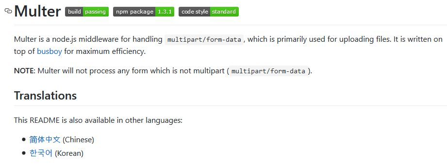
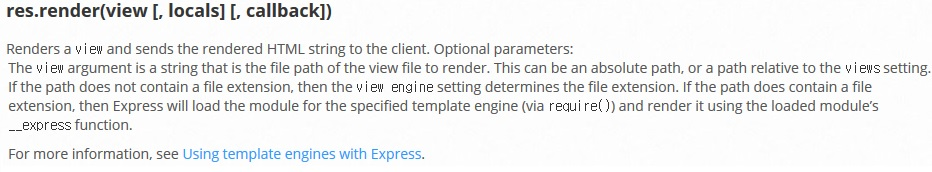
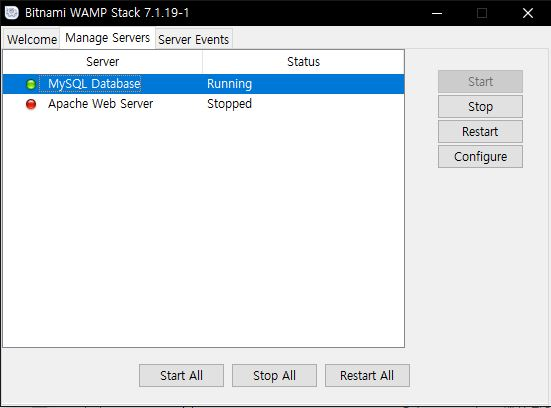

<center> <h1> Node.js 4주차 스터디 </h1>
  <h2> 파일 업로드및 데이터베이스의 사용 </h2>
</center>

---

# 파일 업로드

사용자가 업로드한 파일을 서버의 디렉토리에 저장하는 방법을 
알아봅시다.

그런데 아쉽게도 Express에서는 위의 기능을 지원하지 않습니다.

---

# Multer

Multer는 multipart/form-data를 처리하기 위한 Node.js의 미들웨어.
[Multer github](https://github.com/expressjs/multer) 페이지를 참고해봅시다.



---

# Multer install

```text
PS C:\Users\User\NodeJS> npm install multer --save
npm WARN package@1.0.0 No description
npm WARN package@1.0.0 No repository field.

+ multer@1.3.1
added 21 packages in 2.116s
```

---

# Upload form

```html
<html>
    <head>
        <meta charset = "utf-8">
    </head>
    <body>
        <form action = 'upload' method = 'post' enctype = "multipart/form-data">  
            <p>
                <input type = "file" name = "userfile">
            </p>
            <p>
                <input type = "submit">
            </p>
        </form>
        
    </body>
</html>
```

form에 **enctype="multipart/form-data**를 추가해야 사용자가 
업로드한 파일을 서버에 전송할 수 있습니다.

---

# Upload form


---

# Upload form에 맞는 라우터 작성

```javascript
app.get('/upload', (req, res) => {
    //upload.html 파일 보여주기
})

app.post('/upload', (req, res) => {
    res.send("Uploaded!");
})
```

--- 

# Response render 메소드



* <span style="font-size:80%">view를 화면에 뿌리고, 뿌려진 HTML string을 client에 전달</span>
* <span style="font-size:80%">view는 절대경로이거나 views setting값에 대한 상대경로 이어야 함.</span>
* <span style="font-size:80%">view path가 확장자를 포함하지 않는 경우 view engine setting값으로 파일의 확장자를 결정합니다.</span>

---

# Express app Settings

```javascript
app.set(name, value);
```

```javascript
app.get(name);
```

---

# Special names


```javascript
app.set('views', './views_file');
app.set('view engine', 'html')
app.engine('html', ejs.renderFile);
```

---

# 실습해봅시다!

```javascript
const express    = require('express');
const app        = express();
const bodyParser = require('body-parser');
const ejs        = require('ejs');

app.use(bodyParser.urlencoded({extended:false}));
app.set('views', './views_file');
app.set('view engine', 'html')
app.engine('html', ejs.renderFile);

app.get('/upload', (req, res) => {
    res.render('upload');
})

app.post('/upload', (req, res) => {
    res.send("Uploaded!");
})

app.listen(3000, function(){
    console.log('Connected 3000 port!');
});
```

---

## Multer로 업로드 된 파일을 디렉토리에 저장

Multer github의 README 참고

</img>

---


```html
...
<input type = "file" name = "userfile"> 
...
```
```javascript
const multer     = require('multer')
const upload     = multer({ dest: 'uploads/' })

...

app.post('/upload', upload.single('userfile'), (req, res) => {
    console.log(req.file);
    res.send("Uploaded! : " + req.file.filename);
})
```
---

# 결과

<center></img></center>
<center></img></center>

---

# multer의 옵션으로 dest 대신 storage
<center></img></center>

---

```javascript
const multer     = require('multer')
const storage    = multer.diskStorage({
    destination: function (req, file, cb) {
      cb(null, 'uploads/');
    },
    filename: function (req, file, cb) {
      cb(null, file.originalname);
    }
  });
const upload     = multer({ storage: storage })

...

app.post('/upload', upload.single('userfile'), (req, res) => {
    console.log(req.file);
    res.send("Uploaded! : " + req.file.filename);
})
```

---

# 데이터베이스의 사용

Node.js에서 mySQL을 제어하는 방법을 알아봅시다.

---

# MySQL Install

* **Windows/Mac** : https://bitnami.com/stack/wamp
* **Linux** : sudo apt-get install mysql 치고 tab 두번 눌러서 나오는 목록 중 mysql-server와 mysql-client의 가장 최신버전 설치.

---

# Windows/Mac 

```text
PS C:\Bitnami\wampstack-7.1.19-1>
```

**manager-windows.exe 실행.**


---

Command prompt를 키고 아래 디렉토리에 갑니다.
```text
C:\Bitnami\wampstack-7.1.19-1\mysql\bin>
```

그리고 아래 명령을 실행해줍시다. 이는 모든 플랫폼 공통입니다.
```text
mysql -uroot -p
```

---

# MySQL 실행화면
<center></img></center>

---

# MySQL Table 구성
<center></img></center>
<center><span style="font-size:80%">(출처 : 생활코딩)</span></center>

---

## 생성된 'topic' 테이블을 Node.js에서 제어해봅시다.
**node-mysql** github 참고 (url : https://github.com/mysqljs/mysql)

##### Install
```text
npm install --save node-mysql
```

---

# Create Database
```javascript
const mysql      = require('mysql');
const connection = mysql.createConnection({
    host : 'localhost',
    user : 'root',
    password : 'tlswlgmd12',
});

connection.connect();

var sql = 'CREATE DATABASE ?? CHARACTER SET utf8 COLLATE \
		utf8_general_ci'
var dbName = 'o2';
connection.query(sql, [dbName], (err, rows, fields) => {
    if (err) {
        console.log(err);
    }
    else {
        console.log('Database ' + dbName + ' Created!');
    }
});

connection.end();
```

---

## Create Database table
```javascript
	...
    database : 'o2'	
});

connection.connect();

var sql = 'CREATE TABLE ?? (\
		`id` int(11) NOT NULL AUTO_INCREMENT,\
		`title` varchar(100) NOT NULL,\
		`description` text NOT NULL,\
		`author` varchar(30) NOT NULL,\
		PRIMARY KEY (id)\
	) ENGINE=InnoDB DEFAULT CHARSET=utf8;';
var tableName = 'topic';
connection.query(sql, [tableName], (err, rows, fields) => {
    if (err) {
        console.log(err);
    }
    else {
        console.log('Table ' + tableName + ' Created!');
    }
});

connection.end();
```

---

## INSERT, SELECT 실습해보기

```javascript
var sql = 'INSERT INTO topic (title, description, author) \
	VALUES(?, ?, ?);';
var params = ['DirectX', '3D Rendering API', 'Microsoft'];
connection.query(sql, params, (err, rows, fields) => {
    if (err) {
    	console.log(err);
    }
    else {
    	console.log(rows);
    }
});
```
```javascript
var sql = 'SELECT * FROM topic;';
connection.query(sql, (err, rows, fields) => {
    if (err) {
    	console.log(err)
    } else {
    	for (i = 0; i < rows.length; ++i)
        	console.log(rows[i].description);
    }
});
```

---


# Assignment

* 자신이 원하는 형태의 웹 어플리케이션을 NodeJS 와 MySQL 또는 MongoDB를 사용해서 만들기 	

