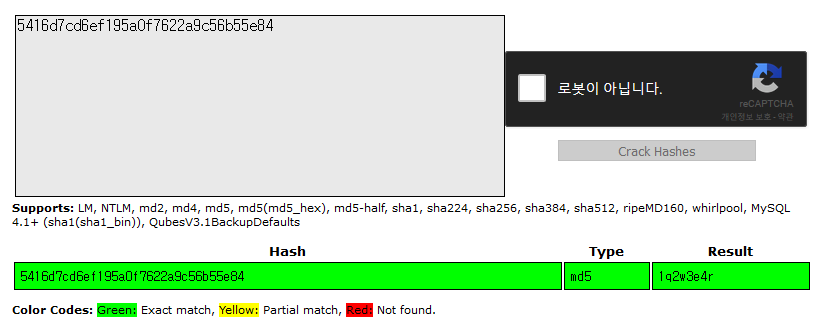
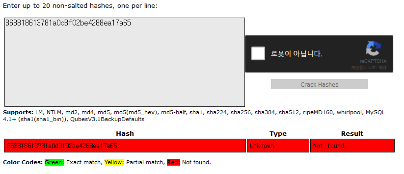

<!-- $theme: gaia -->

# 보안 및 passport
## 오기준

---

# 목 차
- MD5를 이용한 유저 데이터의 암호화
- PBKDF2 알고리즘을 활용한 암호화 심화
- passport의 사용

---

# MD5란?

- Message-Digest Algorithm 5의 줄임말로 128bits의 암호화 해시 함수[1]이다.
- 단방향 암호화이므로 원문 복구가 불가능하다.
- 1996년, 2004년 발견된 결함으로 현재는 美 표준 기술 연구소(NIST)에서 제작한 SHA 시리즈가 실무에서 선호된다.

<small>[1] : 식별자 x를 해싱 테이블 내 버켓 주소로 변환하는 함수</small>

---

# 그럼 이걸 왜하는건가요?

---
# MD5 사용이 쉽기 때문입니다.

---

### SHA 시리즈를 쓰려면 
### Crypto라는 모듈을 써야하는 데
### 이게 좀 난이도가 많이 높아요.

---

# 먼저 MD5 생성을 해봅시다.
하단의 코드에서 여러분들은 `console.log`에 의해 출력된 값을 메모장이나 클립보드에 저장을 해놓아주시길 바랍니다.
```javascript
const md5 = require('md5');

const input = "1q2w3e4r";

console.log(md5(input));
```

---

# MD5의 가장 쉬운 예
``` javascript
const md5 = require('md5');

const data = {
	name: (원하는 이름 아무거나),
    password: (저장한 MD5 결과값)
}

let input = "1q2w3e4r"

console.log(data['password'] === md5(input));
```
이 때의 결과는 **true**가 출력이 되어야 합니다.

---

# 저렇게 만들면 안되는 이유
아래 첨부된 링크에 들어가셔서 본인들의 MD5 결과 값을 넣고 사이트에서 알려주는 내용을 한 번 봐주세요.
> <center>https://crackstation.net</center>


---

# 좀 개선 해봅시다.
```
const md5 = require('md5');

const salt = (긴~ 문장, 특수 문자 있으면 좋음)

const data = {
	name: (원하는 이름 아무거나),
    password: (저장한 md5(input+salt) 결과값)
}

let input = "1q2w3e4r"

console.log(data['password'] === md5(input+salt));
```

---

# 놀랍게도 이 값은 못 찾습니다.


---

# 슬프게도
salt가 하나이면 하다보면 그 값을 특정할 수 있다는 문제가 있습니다. 


<br><br>

<center> <font color =#FF0000><h2>이를 해결하려면 어떻게 해야할까요?</h2></font></center>

---
# 정답은?
```javascript
const md5 = require('md5');

const data = [{
    name: "FO",
    password: '363818613781a0d3f02be4288ea17a65',
    salt: '@!$@!%!51259128!@$!@$'}, 
    {
    name: "BO",
    password: '363818613781a0d3f02be4288ea17a65',
    salt: '234951259128!@$!@$'
}];

let input = "1q2w3e4r";
for(let i = 0; i < data.length; i++){
    console.log(data[i]['password'] 
                === md5(input+data[i]['salt']));
}
```

---

---
# 하지만
계정마다 salt를 만들어준다면 추가적인 저장공간의 사용으로 저장 공간 사용량이 기하급수적으로 생길 수 있는 단점이 있습니다.

---

# PBKDF2로 해결

---

# PBKDF2 알고리즘

- NIST에서 만들어진 salt를 적용한 후 해시함수를 반복하는 알고리즘
- 대중적인 조합 PBKDF2-HMAC-SHA-256/SHA-512
- 일반적인 파라미터는 아래와 같다.
`DIGEST = PBKDF2(PRF, Password, Salt, c, DLen)`
<small>
	- PRF : 난수
	- Password: 패스워드
	- Salt: 암호학 솔트
	- c: 원하는 반복수
	- DLen: 원하는 다이제스트 길이
	
</small>

---

---

# PBKDF2의 사용

```javascript
// pbkdf2-password
const pbkdf2 = require('pbkdf2-password');
const hasher = pbkdf2();
// const md5 = require('md5');

let input = "1q2w3e4r";

hasher({password: input}, (err, pass, salt, hash)=>{
    console.log(err, pass, salt, hash)
});
```

```javascript
hasher({password:input, salt:data['salt']}, 
       (err, pass, salt, hash)=>{
    console.log(hash === data['password'])
});
```

---

# PASSPORT는 소스코드를 보면서 진행하겠습니다.

---
